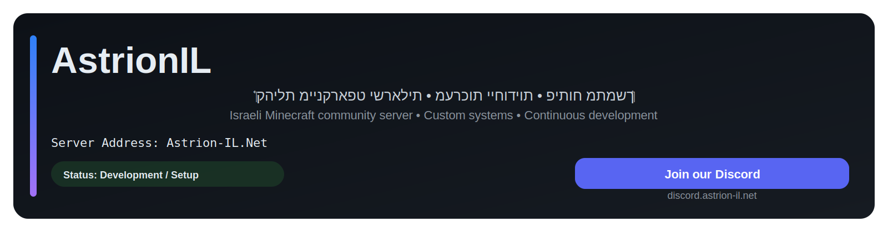
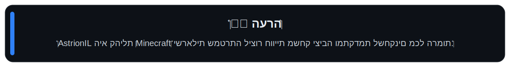
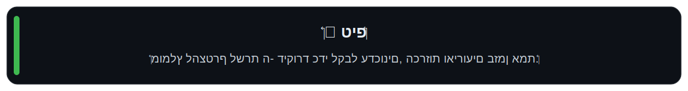
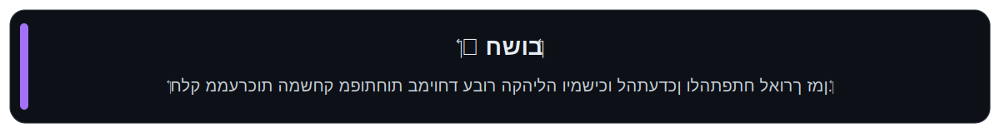
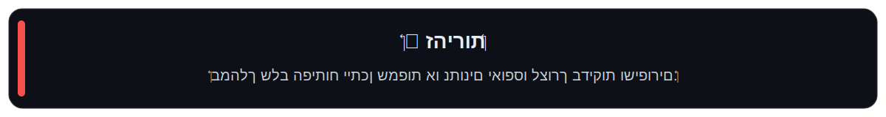
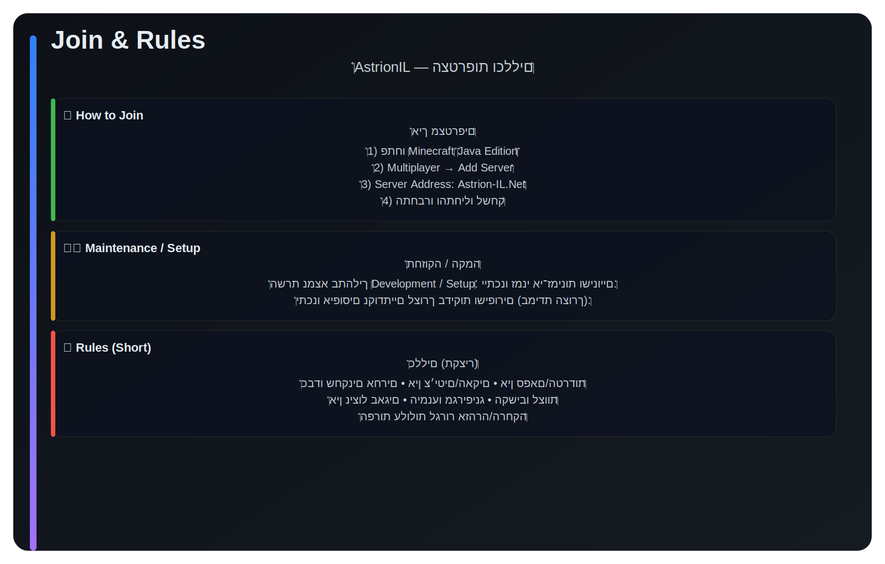
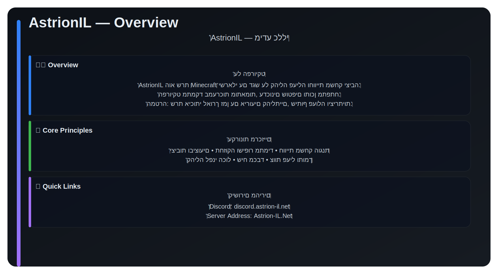
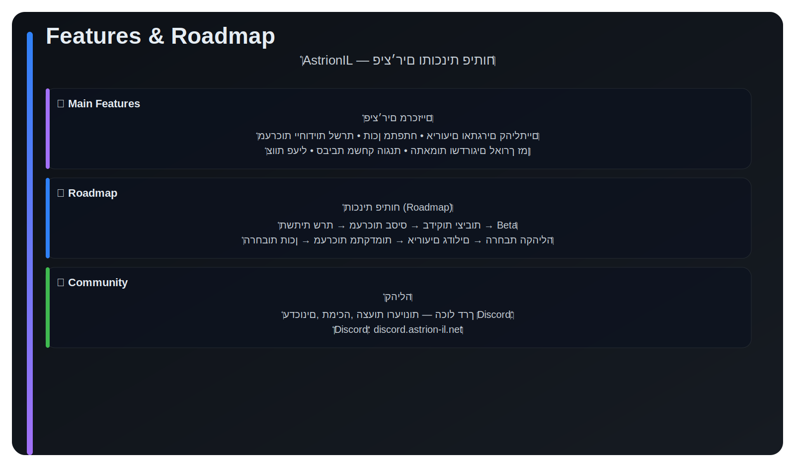

  

  

---

AstrionIL היא קהילת Minecraft ישראלית שמטרתה ליצור חוויית משחק יציבה, מתקדמת ומהנה לשחקנים מכל הרמות. 
השרת מתמקד במערכות ייחודיות, פיתוח מתמשך וקהילה פעילה ושיתופית.

---

## מידע חשוב

---

## מידע על השרת

<b>כתובת השרת</b>

<code>Astrion-IL.Net</code>

<b>דיסקורד</b>

 

---

## איך מצטרפים

---

## מידע כללי

---

## פיצ׳רים ותוכנית פיתוח

---

© AstrionIL Community

